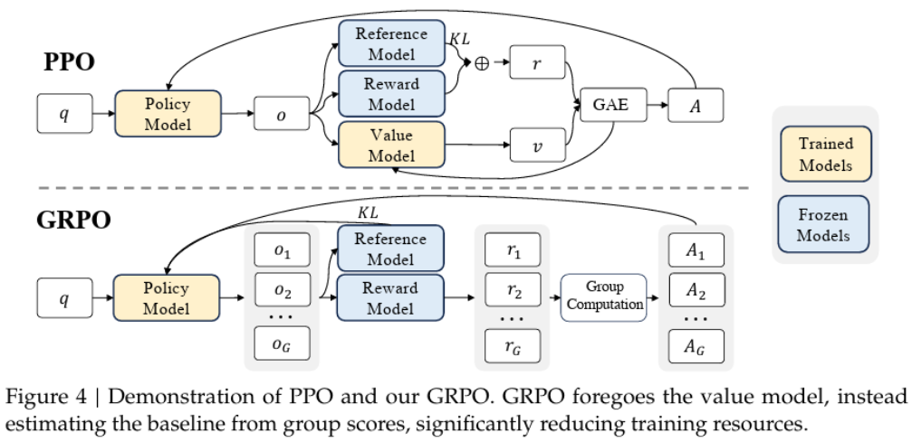
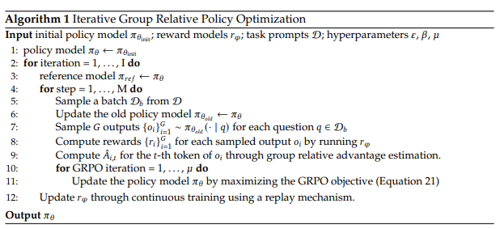

# DeepSeek R1 详解

以下是通过 DeepSeek Chat来理解其原理，我们可以基于它自身来学习。

## 为什么 DeepSeek R1 是一项重大创新和重要突破？

DeepSeek 的 R1 解决了一个重大的 AI 挑战：教会模型在不依赖大量标记推理示例数据集的情况下，进行逐步推理。在 R1-Zero 实验中展示的结果表明，仅靠强化学习就可以发展出高级推理能力，从而避免了对大规模监督训练的需求。

R1-Zero 学会了生成详细的推理步骤，自我检查解决方案，并在更困难的问题上花费更多的计算时间。值得注意的是，这些行为并未被明确编程，而是在训练过程中自然涌现的。这表明，通过精心设计，强化学习可以创建出能够有效推理并灵活适应的模型。

一个关键的突破在于奖励系统的设计。DeepSeek 采用了更简单的基于规则的方法，而不是容易发生“奖励欺骗”的复杂多网络系统。模型因生成正确答案（自动验证）以及产生清晰、结构化的推理而获得奖励。这种方法不仅确保了问题的准确解决，还保证了思维链条的一致性和可读性。

为了验证由大型语言模型（LLM）生成的解决方案，DeepSeek 避免了不可靠的方法，例如人工验证或使用另一个 LLM，这些方法可能会引入错误或幻觉。相反，系统要求 LLM 解决编码、数学或逻辑问题，并将结果与预期输出进行比较。在代码生成的情况下，代码会被执行，并将其输出与真实结果进行对比。这种直接的方法确保了大规模的训练示例和可靠的评估。

## DeepSeek R1 架构设计

<p align="center">
  
</p>

参考下Open R1的复刻架构图：

<p align="center">
  
</p>

### DeepSeek R1 的多阶段训练过程

在 R1-Zero 的成果基础上，DeepSeek R1 实施了一种新颖的四阶段训练流程，旨在保持强大的推理能力的同时，解决纯强化学习的局限性。研究人员在纯强化学习中发现的具体局限性包括：

#### **可读性差**  
尽管 R1-Zero 的输出在逻辑上是正确的，但其结果往往难以理解。这体现在以下几个方面：  
- **解释内容零碎或不清晰**：推理步骤的表达不够连贯，难以追踪逻辑链条。  
- **格式和结构不一致**：响应的格式和结构缺乏统一性，增加了阅读难度。  
- **推理链条难以跟随**：推理过程的逻辑链条不够清晰，使得用户难以理解模型的思考路径。  

#### **语言混杂**  
R1-Zero 经常出现以下问题：  
- **在单次响应中切换语言**：特别是在英语和中文之间频繁切换。  
- **在单一语言查询中混合使用多种语言**：即使查询只用一种语言，模型的响应仍可能混杂多种语言。  
- **推理过程不同部分使用不一致的语言**：不同推理步骤可能使用不同的语言，进一步降低了输出的可读性。  

有趣的是，研究人员在开发 DeepSeek R1 时发现，强制模型使用单一语言反而会略微降低 R1-Zero 的表现。这表明，模型发现使用多种语言进行推理更有效，尽管这让输出对用户不太友好。

#### R1 的开发动机  
正是由于这些局限性，DeepSeek 开发了完整的 R1 模型，并引入了多阶段训练流程，特别是在冷启动数据（cold-start data）和额外的语言一致性奖励方面的改进，以解决上述问题，同时保持强大的推理能力。

#### 总结  
DeepSeek R1 的多阶段训练流程通过精心设计的冷启动数据、语言一致性奖励和逐步增强的推理能力训练，不仅解决了 R1-Zero 的可读性和语言混杂问题，还进一步提升了模型的推理性能和适应性。这一创新方法为 AI 模型的训练和优化提供了新的思路，标志着在智能系统开发领域的重要进展。

### **DeepSeek R1 训练过程详解**  
DeepSeek R1 的训练过程分为四个不同的阶段，每个阶段旨在逐步提升模型的能力。这些阶段相互衔接，从冷启动阶段开始，到最终的通用偏好优化强化学习阶段结束。以下是每个阶段的详细说明：

#### **第一阶段：冷启动阶段**  
**目标**：通过使用高质量推理小数据集对基础模型进行微调，为强化学习（RL）训练建立一个稳定的起点。  

**方法**：  
1. 研究人员通过多种方法收集了一个小规模的长链思维（CoT）示例数据集：  
   - 使用长链思维作为示例进行少样本提示（few-shot prompting）。  
   - 直接提示（未指定）模型生成包含反思和验证的详细答案。  
   - 收集 DeepSeek-R1-Zero 的可读格式输出，并由人工标注者进行后处理优化。  
2. 收集了数千个此类示例，并用于对 **DeepSeek-V3-Base** 模型进行监督微调（SFT）。  
3. 生成的模型作为后续阶段的初始 RL 行为者，避免了从基础模型直接进行 RL 训练的不稳定性。  

#### **第二阶段：推理导向的强化学习**  
**目标**：通过强化学习（RL）提升模型的推理能力，重点关注数学问题解决、编程挑战和逻辑推理任务。  

**方法**：  
1. 在 R1-Zero 使用的 **GRPO 框架** 基础上，引入了额外的 **语言一致性** 奖励组件，以解决 R1-Zero 中观察到的语言混合问题。  
2. 该阶段的所有训练示例均可自动生成并验证其正确性：  
   - **数学**：通过比较结果与预期答案进行验证。  
   - **代码**：通过执行代码并比较输出与预期输出（例如通过单元测试）进行验证。  
3. 训练模型生成准确且语言一致的推理任务解决方案。  

#### **第三阶段：多领域微调**  
**目标**：将模型的能力从推理任务扩展到通用文本生成任务，如写作、角色扮演和事实问答。  

**方法**：  
1. **推理数据**：  
   - 研究人员整理了推理提示，并通过从第二阶段训练的模型中进行拒绝采样生成了推理轨迹。  
   - 使用 **DeepSeek-V3** 判断输出质量。  
   - 为提高可读性，过滤掉混合语言、长段落和代码块的输出。  
   - 对每个提示进行多次采样，仅保留正确的响应。  
   - **结果**：收集了约 **60 万条推理相关的训练示例**。  
2. **非推理数据**：  
   - 对于写作、事实问答和翻译等任务，研究人员重用了 **DeepSeek-V3 SFT 数据集** 的部分内容。  
   - 对于某些任务，使用 DeepSeek-V3 生成链式思维（CoT）后再回答问题。较简单的查询（如“你好”）不需要 CoT。  
   - **结果**：收集了约 **20 万条非推理训练示例**。  
3. 使用包含约 **80 万条示例**（推理 + 非推理）的最终整理数据集对模型进行两轮微调。  
4. **训练方法**：采用监督微调（SFT）而非继续强化学习。  

#### **第四阶段：通用偏好优化**  
**目标**：通过优化人类在通用场景中的偏好，进一步优化模型的输出质量。  

**方法**：  
1. 引入了 **通用偏好优化强化学习**，如训练过程开头所述。  
2. 训练模型生成的解决方案不仅要准确解决问题，还要在可读性、清晰度和用户友好性方面符合人类偏好。  
3. 此阶段结合了 **机器生成的可验证问题-解决方案对** 和 **人工标注的解决方案偏好**，以指导模型生成更高质量的输出。  

#### **总结**  
- **第一阶段**：使用小规模推理示例数据集进行冷启动，以稳定 RL 训练过程。  
- **第二阶段**：以推理为导向的 RL，结合自动验证和语言一致性奖励。  
- **第三阶段**：多领域微调，将模型能力扩展到通用文本生成任务。  
- **第四阶段**：通用偏好优化，根据人类偏好优化输出质量。

## **DeepSeek R1-Zero 和 R1**
DeepSeek 开发的 R1-Zero 和 R1 重新思考了如何训练大型语言模型以实现高级推理能力。他们的方法质疑了广泛监督微调是必要的主流观点。相反，他们证明了纯强化学习在自动生成的训练样本上（将成本降为零）应用时，如果结构合理，可以产生令人印象深刻的推理能力。

### **R1-Zero：纯强化学习**
R1-Zero 表明，复杂的推理能力（或思维链能力）可以在大型语言模型（LLM）中通过纯强化学习自然涌现，而无需传统的监督微调阶段。该模型基于 DeepSeek-V3-Base 架构，拥有 6710 亿参数，代表了与传统训练方法的显著不同。

### **架构细节**
R1-Zero 的基础架构由 **61 个 Transformer 解码器模块**组成，采用了混合注意力机制。前三个解码器模块使用密集注意力（词汇量为 13 万 token，嵌入维度为 7168），为基本模式识别和上下文理解奠定了基础。

其余解码器模块采用**混合专家（MoE）架构**，可以更高效（成本更低、速度更快）地处理输入 token。  
MoE 架构是一种模型扩展方法，它使用多个专门的神经网络或专家（在 R1 中，每个模块有 256 个专家）以及一个学习到的路由机制（通常是门控网络），动态地将不同输入分配给最合适的专家。与将所有 token 通过整个网络处理不同，MoE 模型为每个 token 选择性激活一部分专家（在 R1 中是 8 个），路由器根据输入的特性决定启用哪些专家。如果你不熟悉 MoE 的内部工作原理，可以阅读这篇文章，然后继续了解 R1-Zero 的训练过程。

### **训练过程**
训练从 DeepSeek-V3-Base 模型开始，该模型已经通过 14.8 万亿 token 的预训练，能够在给定上下文中预测下一个 token。

**Group Relative Policy Optimization（GRPO）** 是 DeepSeek 在语言模型强化学习中的一项创新。我们来看看它的工作原理以及它与传统方法的区别。

### **使用 PPO 的 RLHF**
传统的 RLHF（基于人类反馈的强化学习）依赖于近端策略优化（PPO）算法。PPO 在 RLHF 中是一种利用奖励信号训练语言模型以生成更好输出的方法。如果你不熟悉这一主题，可以阅读这篇文章，然后继续了解 GRPO。简而言之，使用 PPO 的 RLHF 过程如下：

**关键组件：**
- **策略模型（Actor）**：正在训练的生成文本的语言模型  
- **参考模型**：通常是初始的监督微调（SFT）模型，保持“冻结”状态  
- **奖励模型**：根据人类偏好训练，用于对输出进行评分  
- **价值模型（Critic）**：预测未来预期奖励以进行优势估计  

**过程：**
1. 策略模型为给定提示生成文本输出  
2. 奖励模型对这些输出进行评分  
3. 价值模型估计每个 token 位置的预期奖励  
4. PPO 计算优势——每个动作（预测的 token）比预期好或差多少  
5. 更新策略模型，以增加导致高于预期奖励的动作的概率  
6. 参考模型的 KL 惩罚（Kullback-Leibler 散度）防止策略变化过大  

RLHF 中最具挑战性的部分是，奖励只在最后（当完整文本被评估时）出现，但模型需要为其生成的每个 token 提供反馈。价值模型通过学习预测未来奖励，帮助系统将所有导致良好结果的决策的功劳分配。

训练循环交替进行：
1. 收集生成的批次及其奖励  
2. 使用 PPO 目标更新策略  
3. 定期更新价值模型以更好预测奖励  

所有这些共同作用，逐渐引导模型生成获得更高奖励的输出，同时保持连贯和高质量的文本生成。这是一个复杂的优化过程，需要仔细调整多个组件和超参数以有效运行。

### **使用 GRPO**

GRPO 是 PPO 的一种变体，它在保持有效强化学习的同时，消除了对价值模型的需求。GRPO 采用了与 PPO 不同的方法：它不使用价值模型来估计优势计算中的基线，而是为每个输入生成多个输出，并使用每组输出的平均奖励作为基线。这意味着，如果你为一个数学问题生成了 64 个输出，其中一个解决方案的奖励为 0.9，而组平均值为 0.7，那么该解决方案将获得 0.2 的正向优势。这种基于组的方法提供了一种自然的方式来判断输出是好于还是差于平均水平，而无需单独的价值模型进行预测。虽然 RLHF/PPO 和 GRPO 都旨在通过奖励信号改进模型，但 GRPO 通过利用组统计而不是训练额外的价值模型，更高效地实现了这一目标。这也使 GRPO 与 DPO 不同，因为 DPO 侧重于直接优化成对输出之间的偏好概率，而不是使用任何形式的优势估计。

<p align="center">
  
</p>

GRPO 最显著的特点之一是自我验证行为的出现。随着训练的进行，模型自然地发展出捕捉和纠正自身错误的能力。这体现在研究人员所称的“顿悟时刻”——模型明确识别推理中的错误并修正其方法的实例。例如，在解决复杂的数学问题时，模型可能会写“等等，我注意到前一步有错误...”，然后继续纠正其计算。这种行为并非明确编程，而是作为基于组的奖励结构的结果而出现。

**奖励结构设计**

<p align="center">
  
</p>

DeepSeek 训练过程中的奖励结构由多个部分组成，这些部分共同协作以指导模型学习，而不需要人类反馈。其核心系统使用两种主要类型的奖励：**准确性奖励和格式奖励**：

“准确性奖励模型评估响应是否正确。例如，在有确定性结果的数学问题中，模型需要以指定格式（如在一个方框内）提供最终答案，从而实现基于规则的可靠正确性验证。同样，对于 LeetCode 问题，可以使用编译器根据预定义的测试用例生成反馈。”

“除了准确性奖励模型，我们还采用了一个格式奖励模型，要求模型将其思考过程放在 `<think>` 和 `</think>` 标签之间。”

这种奖励结构的一个特别创新的方面是，它能够在没有任何人类反馈的情况下推动改进。该系统完全依赖于程序化验证和结构分析，使其具有高度可扩展性。这种方法使训练过程能够快速评估数百万个响应，从而实现快速迭代和改进。没有人类反馈也消除了人类评估者可能引入的潜在偏见，并允许模型发现人类可能不会考虑的新颖解决问题的方法。

## 关于 KL 散度

KL散度（Kullback-Leibler divergence），也被称为相对熵（relative entropy），是信息论中用于度量两个概率分布差异的一种方式。它衡量的是一个概率分布相对于另一个概率分布的“信息增益”或者“信息损失”。

### 定义

设 $P$ 和 $Q$ 是两个定义在同一随机变量 $X$ 上的概率分布，KL 散度 $D_{\text{KL}}(P \parallel Q)$ 的定义为：

$$
D_{\text{KL}}(P \parallel Q) = \sum_{x \in X} P(x) \log\left(\frac{P(x)}{Q(x)}\right)
$$

如果 $P$ 和 $Q$ 是连续概率分布，则 KL 散度定义为：

$$
D_{\text{KL}}(P \parallel Q) = \int_{-\infty}^{\infty} P(x) \log\left(\frac{P(x)}{Q(x)}\right) dx
$$

这里，$\log$ 通常采用自然对数（ln），但也可以根据应用场合选择其他对数底数。

### 特点
- **非对称性**：KL散度不是距离度量，因为它是非对称的，即 $D_{\text{KL}}(P \parallel Q) \neq D_{\text{KL}}(Q \parallel P)$，也就是说，从 $P$ 到 $Q$ 的散度和从 $Q$ 到 $P$ 的散度通常是不同的。
- **非负性**：KL散度总是非负的，即 $D_{\text{KL}}(P \parallel Q) \geq 0$。
- **唯一最小值**：仅当 $P = Q$ 时，$D_{\text{KL}}(P \parallel Q) = 0$。这意味着两个相等的分布之间的 KL 散度为零，是唯一可以使 KL 散度为零的情况。

### 实际应用
- **模型拟合**：在机器学习中，KL 散度经常用于衡量预测的概率分布和真实概率分布之间的差异，特别在最大似然估计和生成对抗网络（GANs）中。
- **信息增益**：当 $P$ 代表实际或目标分布，而 $Q$ 代表模型估计分布时，KL 散度可以提供关于 $Q$ 对 $P$ 的信息增益的指标。
- **编码理论**：在编码理论中，KL 散度可以解释为使用 $Q$ 编码 $P$ 的“多余信息”。

### 注意事项
使用 KL 散度时，必须确保 $Q(x)$ 在 $P(x) > 0$ 的所有点上都是正的，因为如果 $Q(x) = 0$ 而 $P(x) > 0$，则 $\log\left(\frac{P(x)}{Q(x)}\right)$ 为无穷大，导致 KL 散度定义不明确。在实际中，通常采用小的正数（如 $\epsilon > 0$）平滑 $Q(x)$ 来避免这种情况。

## 关于交叉熵损失

交叉熵损失（Cross-Entropy Loss）是一种常用的损失函数，特别是在分类问题中，比如深度学习中的图像分类、自然语言处理中的文本分类等任务。它衡量的是模型预测概率分布与实际概率分布之间的差异，越相似则损失越小，越不相似则损失越大。

### 理解交叉熵损失

假设我们有一个分类问题，总共有 $K$ 个类别，对于每一个样本，模型会输出对每一个类别的预测概率，我们记为 $\hat{y}_i$ 表示第 $i$ 个类别的预测概率。实际上只有一个类别的 $\hat{y}_i$ 应该接近1，其余接近0。

实际标签通常以 one-hot 编码的形式给出，记为 $y_i$。例如，如果一个样本实际上是类别 2，在一个三分类问题中，其 one-hot 编码就是 $[0, 1, 0]$。

### 交叉熵损失公式

对于单个样本的交叉熵损失定义为：
$$
\mathcal{L} = -\sum_{i=1}^{K} y_i \log(\hat{y}_i)
$$

其中 $\log$ 表示自然对数，这种损失函数会将正确分类的对数概率放大（因为概率的对数），而惩罚那些分类错误的概率（因为对数会将0~1区间内的数映射到负无穷到0之间，越接近0的预测概率，损失就会越大）。

### 平均交叉熵损失

在训练神经网络时，我们通常计算的是一个批次内所有样本的平均交叉熵损失，即：
$$
\mathcal{L}_{\text{avg}} = -\frac{1}{N}\sum_{n=1}^{N}\sum_{i=1}^{K} y_i^{(n)} \log(\hat{y}_i^{(n)})
$$

其中 $N$ 是批次大小，$y_i^{(n)}$ 和 $\hat{y}_i^{(n)}$ 分别表示第 $n$ 个样本的实际标签和模型预测概率。

### 交叉熵损失的优势

1. **目标清晰**：交叉熵损失目标明确，对模型的优化直接作用于分类准确率的提高。
2. **数值稳定性**：通过对概率应用对数，可以有效避免数值上乘法可能引起的下溢问题。
3. **梯度引导**：损失函数的导数对模型参数的梯度更新有明确的指导作用，使学习过程高效收敛。

### 实现和使用

在深度学习框架中，例如 PyTorch 和 TensorFlow，都有内建的交叉熵损失函数，可以方便地在模型训练过程中使用。例如，在 PyTorch 中，可以使用 `nn.CrossEntropyLoss()`，并且通常和 softmax 函数结合使用，因为交叉熵损失函数实际上已经包含了 softmax 层的效果（即 log_softmax + NLLLoss）。这使得我们可以直接将模型的原始输出（logits）传递给损失函数。

## 代码详解

参考的是HuggingFace的open-r1代码

```python
    # Load the dataset
    dataset = load_dataset(script_args.dataset_name, name=script_args.dataset_config)

    # Get reward functions
    REWARD_FUNCS_REGISTRY = {
        "accuracy": accuracy_reward,
        "format": format_reward,
        "reasoning_steps": reasoning_steps_reward,
        "cosine": get_cosine_scaled_reward(
            min_value_wrong=script_args.cosine_min_value_wrong,
            max_value_wrong=script_args.cosine_max_value_wrong,
            min_value_correct=script_args.cosine_min_value_correct,
            max_value_correct=script_args.cosine_max_value_correct,
            max_len=script_args.cosine_max_len,
        ),
        "repetition_penalty": get_repetition_penalty_reward(
            ngram_size=script_args.repetition_n_grams,
            max_penalty=script_args.repetition_max_penalty,
        ),
    }
    reward_funcs = [REWARD_FUNCS_REGISTRY[func] for func in script_args.reward_funcs]

    # Format into conversation
    def make_conversation(example):
        return {
            "prompt": [
                {"role": "system", "content": SYSTEM_PROMPT},
                {"role": "user", "content": example["problem"]},
            ],
        }

    dataset = dataset.map(make_conversation)
    for split in dataset:
        if "messages" in dataset[split].column_names:
            dataset[split] = dataset[split].remove_columns("messages")

    logger.info("*** Initializing model kwargs ***")
    torch_dtype = (
        model_args.torch_dtype if model_args.torch_dtype in ["auto", None] else getattr(torch, model_args.torch_dtype)
    )
    model_kwargs = dict(
        revision=model_args.model_revision,
        trust_remote_code=model_args.trust_remote_code,
        attn_implementation=model_args.attn_implementation,
        torch_dtype=torch_dtype,
        use_cache=False if training_args.gradient_checkpointing else True,
    )
    training_args.model_init_kwargs = model_kwargs

    #############################
    # Initialize the GRPO trainer
    #############################
    trainer = GRPOTrainer(
        model=model_args.model_name_or_path,
        reward_funcs=reward_funcs,  # 传递奖励函数
        args=training_args,
        train_dataset=dataset[script_args.dataset_train_split],
        eval_dataset=dataset[script_args.dataset_test_split] if training_args.eval_strategy != "no" else None,
        peft_config=get_peft_config(model_args),
        callbacks=get_callbacks(training_args, model_args),
    )

    ###############
    # Training loop
    ###############
    logger.info("*** Train ***")
    checkpoint = None
    if training_args.resume_from_checkpoint is not None:
        checkpoint = training_args.resume_from_checkpoint
    elif last_checkpoint is not None:
        checkpoint = last_checkpoint
    train_result = trainer.train(resume_from_checkpoint=checkpoint)
    metrics = train_result.metrics
    metrics["train_samples"] = len(dataset[script_args.dataset_train_split])
    trainer.log_metrics("train", metrics)
    trainer.save_metrics("train", metrics)
    trainer.save_state()

    ##################################
    # Save model and create model card
    ##################################
    logger.info("*** Save model ***")
    trainer.save_model(training_args.output_dir)
    logger.info(f"Model saved to {training_args.output_dir}")
```